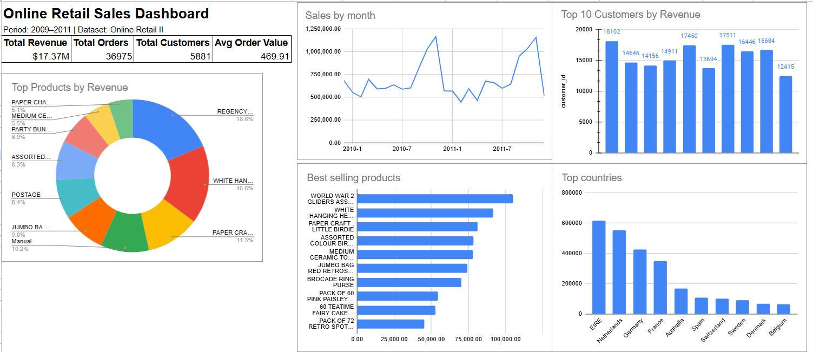

# Online Retail Sales Analysis Dashboard

## Project Overview

This project analyzes the Online Retail II dataset using SQL, PostgreSQL, and Google Sheets.

The goal was to clean raw transactional data, calculate business KPIs, perform customer analysis, and create a sales dashboard.

---

## Dataset

Dataset: Online Retail II

Contains transactional data from an online retail company between 2009–2011.

---

## Tools Used

- PostgreSQL
- SQL
- Google Sheets
- GitHub

---

## Data Cleaning

The following cleaning steps were performed:

- Removed cancelled orders (`Invoice LIKE 'C%'`)
- Removed negative quantities
- Removed rows with missing customer IDs
- Removed duplicate records
- Created revenue column

---

## Business Questions

The project answers:

- What is total revenue?
- How many orders and customers are there?
- Which products generate the highest revenue?
- Which products sell most frequently?
- Which countries generate the most revenue?
- What is average order value?
- How do sales change over time?
- Who are the top customers?
- Which products underperform?
- RFM customer analysis

---

## Dashboard



---

## Key Insights

- Total revenue exceeded $17M
- United Kingdom generated the majority of sales
- Several products had very low sales performance
- A small group of customers generated significant revenue
- Customer purchasing behavior was analyzed using RFM metrics

---

## Project Structure

```text
online-retail-sales-analysis
│
├── sql
│   ├── data_cleaning.sql
│   ├── kpi_queries.sql
│   ├── product_analysis.sql
│   ├── customer_analysis.sql
│   ├── country_analysis.sql
│   ├── time_analysis.sql
│   └── rfm_analysis.sql
│
├── dashboard
│   └── dashboard.png
│
└── README.md
